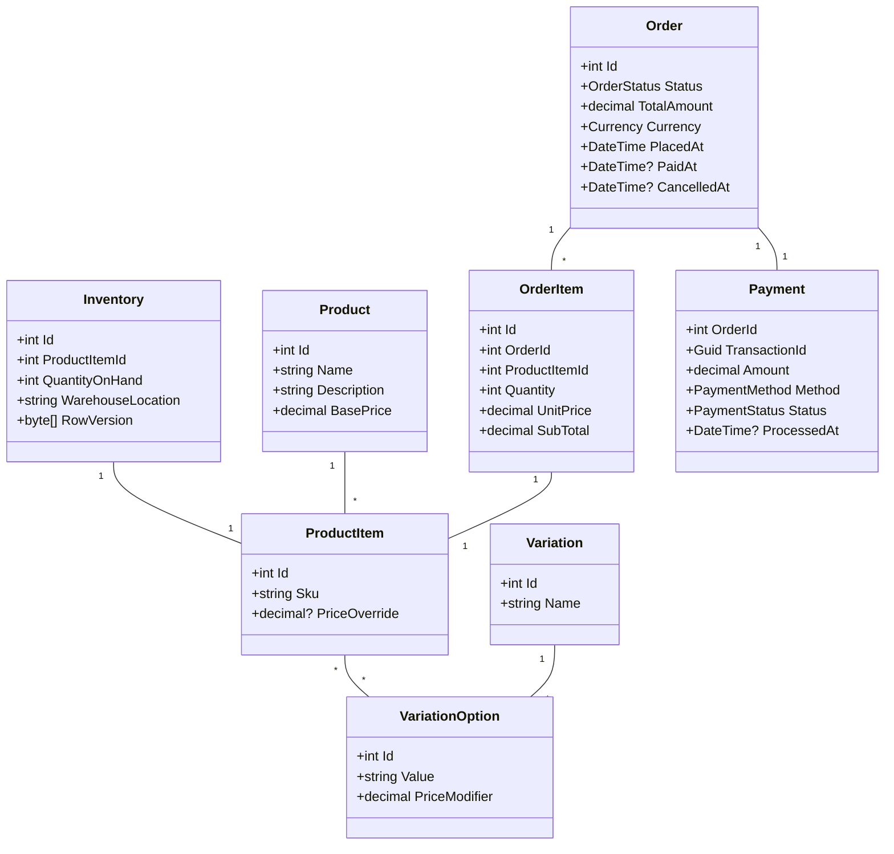

# 🛒 Concurrent Order Processing System

A high-performance, scalable **e-commerce backend** built with **.NET 8**, featuring **microservices**, **CQRS**, **Clean Architecture**, **gRPC**, **JWT Authentication**, and **Docker**.

---

## 🧱 Architecture Overview

### ⚙️ Microservices

| Service                     | Description                                                | Pattern        |
| --------------------------- | ---------------------------------------------------------- | -------------- |
| **OrderService**            | Handles order creation, updates, cancellations, incentives | ✅ CQRS + Clean |
| **ProductInventoryService** | Manages product stock, reservations, and availability      | ✅ CQRS + Clean |
| **IdentityService**         | Manages user registration, login, JWT, and roles           | ❌ No CQRS      |

---

## 🧩 Folder Structure

```
BackendSolution
│
├── src
│   └── Services
│       ├── OrderService
│       │   ├── EasyOrderOrder.Api
│       │   ├── EasyOrderOrder.Application.Contracts
│       │   ├── EasyOrderOrder.Application.Commands
│       │   ├── EasyOrderOrder.Application.Queries
│       │   ├── EasyOrderOrder.Domain
│       │   ├── EasyOrderOrder.Infrastructure
│       │   └── OrderService.Tests  # Unit & integration tests for OrderService
│       │
│       ├── ProductInventoryService
│       │   ├── EasyOrderInventory.Api
│       │   ├── EasyOrderInventory.Application.Contracts
│       │   ├── EasyOrderInventory.Application.Commands
│       │   ├── EasyOrderInventory.Application.Queries
│       │   ├── EasyOrderInventory.Domain
│       │   ├── EasyOrderInventory.Infrastructure
│       │   └── ProductInventoryService.Tests  # Unit & integration tests for InventoryService
│       │
│       └── IdentityService
│           ├── EasyOrderIdentity.Api
│           ├── EasyOrderIdentity.Application
│           ├── EasyOrderIdentity.Domain
│           ├── EasyOrderIdentity.Infrastructure
│           └── IdentityService.Tests  # Unit & integration tests for IdentityService
│
├── Shared
│   └── Common Auth, DTOs, Logging, Extensions
│
├── API Gateway
│   └── Ocelot configuration (Swagger merge, routing, rate limiting)
│
├── docker
│   └── docker-compose.yml, Dockerfiles, .env
│
└── (tests moved into each service as shown above)
```

---

## 🚀 Key Features

* 🔄 **CQRS + Clean Architecture** for Order & Inventory services
* 🔐 **JWT-based Authentication** via IdentityService
* 📦 **gRPC Communication** for service-to-service calls
* ⚙️ **Dockerized** deployment for consistent environments
* 🛠️ **Hangfire** for error logging, background jobs, and payment retries
* 📘 **Swagger** for API documentation
* 🧪 **xUnit** for robust unit/integration testing

---

## 📖 Domain Entities & Class Diagram

We define core models with soft-delete, concurrency controls, and relationships.



All entities inherit from `BaseSoftIntDelete` or `BaseSoftDelete` (timestamps, audit, soft-delete).

---

## 🧠 Design Principles & Patterns

### ✅ CQRS (Order & Inventory)

* **Command Side**: Writes handled via MediatR command handlers in `Application.Commands`.
* **Query Side**: Reads served by optimized projections in `Application.Queries`.
* **Atomic Transactions**: Commands wrap updates across aggregates and external gRPC calls.

### 🔄 Mediator Pattern

* **MediatR** is used to decouple request handlers from controllers.
* Controllers act as thin adapters: they map HTTP/gRPC requests to commands or queries and pass them to `_mediator.Send(...)`.
* Example in a controller using CQRS, Rate Limiting, and Mediator:

  ```csharp
  [HttpPost(OrderRoutes.Create)]
  [EnableRateLimiting("FixedPolicy")]
  public async Task<IActionResult> CreateOrder([FromBody] CreateOrderDto dto)
  {
      var command = new CreateOrderCommand(dto);
      var response = await _mediator.Send(command);
      return StatusCode(response.StatusCode, response);
  }
  ```

Controllers remain minimal, handling only routing, rate limiting, and response statuses.

### 🧱 Clean Architecture & Separation of Concerns & Separation of Concerns

* **Controllers/Endpoints**: Handle only input validation/mapping and output formatting.
* **Services/Handlers**: Contain all business logic in the service layer, not in controllers.
* **Interfaces/Contracts**: Define clear boundaries between layers using dependency injection.
* Ensures maintainability, testability, and clear ownership of responsibilities.

### 🛠 Structural Design Patterns

* **Dependency Injection**: Configures services, repositories, interceptors via built-in .NET DI.
* **Repository Pattern**: `IRepository<T>` abstracts data access logic.
* **Unit of Work**: `IUnitOfWork` batches multiple repository operations in one transaction.
* **Factory Pattern**: Dynamically constructs instances (e.g., repository factories).
* **Adapter Pattern**: Wraps external SDKs (e.g., payment gateways) into internal interfaces (`IPaymentClient`).
* **Outbox Pattern**: Persists domain events in an outbox table for reliable asynchronous dispatch.
* **Singleton Pattern**: Shared application settings (`IOptions<T>`) and single-instance services.

### 💳 Behavioral Design Patterns

* **Strategy Pattern**: Supports multiple payment methods by implementing `IPaymentStrategy` for each provider.

### 🛑 Global Error Handling

* **Custom Error Middleware** intercepts exceptions across the application.
* Converts uncaught exceptions into standardized API responses (e.g., `ProblemDetails`).
* Logs errors centrally and returns consistent error shapes:

  ```csharp
  app.UseMiddleware<ErrorHandlingMiddleware>();
  ```

---

## 🔄 EF Core Interceptors & SaveChanges Hook & SaveChanges Hook

A custom interceptor enforces:

* **Permission Checks**: Validates user roles per entity before modifications.
* **Audit Logging**: Populates `CreatedOn`, `ModifiedOn`, `CreatedBy`, `ModifiedBy`.

```csharp
options.AddInterceptors(new AuditAndPermissionInterceptor(currentUserService));
```

---

## 🤝 Payment Processing & Hangfire

1. **Charge Request**: `OrderService` calls `PaymentService` via gRPC.
2. **Retry Mechanism**: Hangfire jobs retry on transient failures using exponential backoff.
3. **Success Handling**: On successful payment, update `Order.PaidAt` and `Status`.
4. **Failure Handling**: After configurable retries, log audit entry and alert administrators.

---

## 🎁 Order Incentive Handling

To apply promotions and loyalty incentives:

1. **ApplyIncentiveCommand**: Dispatched alongside `CreateOrderCommand`.
2. **gRPC Validation**: OrderService invokes InventoryService or IncentiveService via gRPC to validate stock and promotion.
3. **Domain Event**: Emits `OrderCreatedWithIncentive` for downstream projections (read models).
4. **Read Model Update**: Queries reflect discounted totals and incentive usage.

> **Note**: Full RabbitMQ/Rebus integration for asynchronous messaging is deferred to Phase 2.

---

## 👥 Data Seeding

Default roles and users are seeded at application startup.

---

## 📬 gRPC Communication

| From → To                           | Purpose                        |
| ----------------------------------- | ------------------------------ |
| **OrderService → InventoryService** | Reserve or release stock       |
| **InventoryService → OrderService** | Confirm availability           |

---

## 📦 Docker & CI/CD

### Prerequisites

* [.NET 8 SDK](https://dotnet.microsoft.com/download)
* [Docker & Docker Compose](https://www.docker.com)

### Local Setup

```bash
# Clone repository
git clone https://github.com/your-org/BackendSolution.git
cd BackendSolution
# Configure environment variables
cp docker/.env.example docker/.env
# Build & run
docker-compose up --build
```

### Running Tests

```bash
cd src/Services/OrderService

dotnet test OrderService.Tests

cd ../ProductInventoryService

dotnet test ProductInventoryService.Tests

cd ../IdentityService

dotnet test IdentityService.Tests
```

---

## 🛠 Environment Variables

Configure `.env` per service:

```dotenv
# DB
DATABASE__CONNECTIONSTRING=Server=...;Database=...;User=...;Password=...
# OrderService
dotnet_order__grpc__port=5001
# InventoryService
dotnet_inventory__grpc__port=5002
# IdentityService
identity__jwt__key=YourSuperSecretKey
identity__jwt__issuer=YourIssuer
```

---

## 📜 License

Licensed under the MIT License. See [LICENSE](LICENSE) for details.
