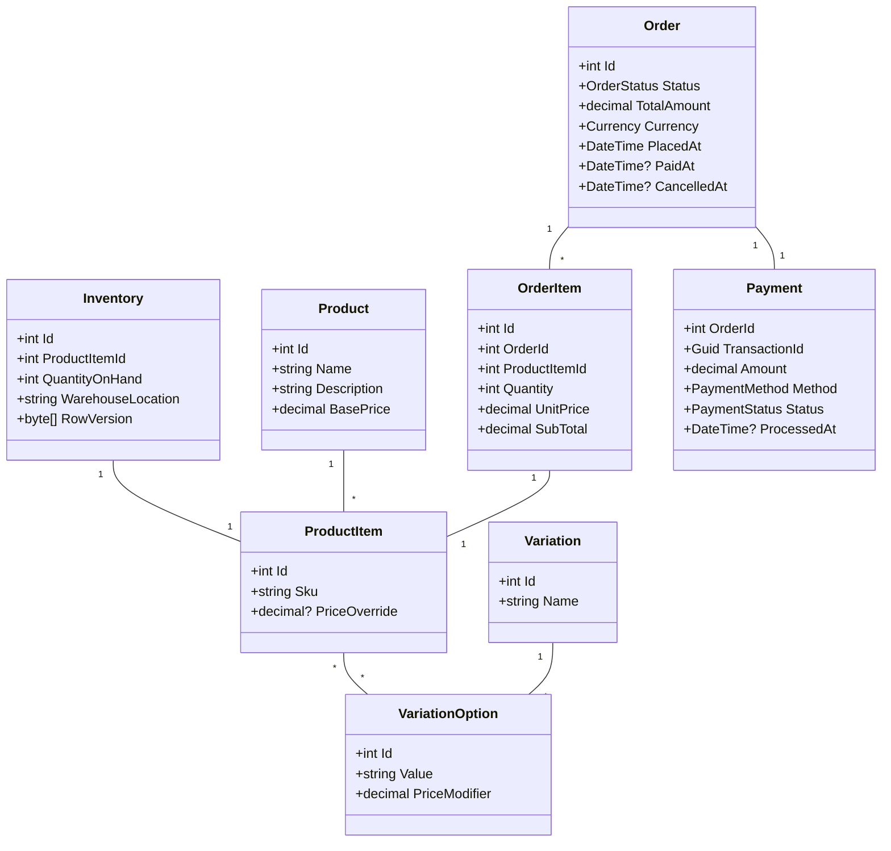

# 🛒 Concurrent Order Processing System

A high-performance, scalable **e-commerce backend** built with **.NET 8**, featuring **microservices**, **CQRS**, **Clean Architecture**, **gRPC**, **JWT Authentication**, and **Docker**.

---

## 🧱 Architecture Overview

### ⚙️ Microservices

| Service                     | Description                                                | Pattern        |
| --------------------------- | ---------------------------------------------------------- | -------------- |
| **OrderService**            | Handles order creation, updates, cancellations, incentives | ✅ CQRS + Clean |
| **ProductInventoryService** | Manages product stock, reservations, and availability      | ✅ CQRS + Clean |
| **IdentityService**         | Manages user registration, login, JWT, and roles           | ❌ No CQRS      |

---

## 🧩 Folder Structure

```
BackendSolution
│
├── src
│   └── Services
│       ├── OrderService
│       │   ├── EasyOrderOrder.Api
│       │   ├── EasyOrderOrder.Application.Contracts
│       │   ├── EasyOrderOrder.Application.Commands
│       │   ├── EasyOrderOrder.Application.Queries
│       │   ├── EasyOrderOrder.Domain
│       │   ├── EasyOrderOrder.Infrastructure
│       │   └── OrderService.Tests  # Unit & integration tests for OrderService
│       │
│       ├── ProductInventoryService
│       │   ├── EasyOrderInventory.Api
│       │   ├── EasyOrderInventory.Application.Contracts
│       │   ├── EasyOrderInventory.Application.Commands
│       │   ├── EasyOrderInventory.Application.Queries
│       │   ├── EasyOrderInventory.Domain
│       │   ├── EasyOrderInventory.Infrastructure
│       │   └── ProductInventoryService.Tests  # Unit & integration tests for InventoryService
│       │
│       └── IdentityService
│           ├── EasyOrderIdentity.Api
│           ├── EasyOrderIdentity.Application
│           ├── EasyOrderIdentity.Domain
│           ├── EasyOrderIdentity.Infrastructure
│           └── IdentityService.Tests  # Unit & integration tests for IdentityService
│
├
│   
│
├── API Gateway
│   └── Ocelot configuration (Swagger merge, routing, rate limiting)
│
├── docker
    └── docker-compose.yml
```

---

## 🚀 Key Features

* 🔄 **CQRS + Clean Architecture** for Order & Inventory services
* 🔐 **JWT-based Authentication** via IdentityService
* 📦 **gRPC Communication** for service-to-service calls
* ⚙️ **Dockerized** deployment for consistent environments
* 🛠️ **Hangfire** for error logging, background jobs, and payment retries
* 📘 **Swagger** for API documentation
* 🧪 **xUnit** for robust unit/integration testing

---

## 📖 Domain Entities & Class Diagram

We define core models with soft-delete, concurrency controls, and relationships.



All entities inherit from `BaseSoftIntDelete` or `BaseSoftDelete` (timestamps, audit, soft-delete).

---

## 🧠 Design Principles & Patterns

### ✅ CQRS (Order & Inventory)

* **Command Side**: Writes handled via MediatR command handlers in `Application.Commands`.
* **Query Side**: Reads served by optimized projections in `Application.Queries`.
* **Atomic Transactions**: Commands wrap updates across aggregates and external gRPC calls.

### ⚡️ Read/Write Database Strategy & Async Data Synchronization

To support **CQRS**, we maintain separate **Write** and **Read** databases:

* **WriteDb**: Handles all transactional commands (INSERT/UPDATE/DELETE) without added read-side indexing overhead.
* **ReadDb**: Serves optimized queries with freely created nonclustered indexes and projections.

Changes in the WriteDb are propagated **asynchronously** to the ReadDb via **SQL Server triggers** on relevant tables. These triggers capture `INSERT`, `UPDATE`, and `DELETE` operations and apply them to the ReadDb to keep data in sync.

#### Example: Product Trigger

```sql
USE [EasyOrder_WriteDb]
GO
-- Trigger: Sync changes from WriteDb.Product to ReadDb.Product
ALTER TRIGGER [dbo].[trg_SyncProduct]
ON [dbo].[Product]
AFTER INSERT, UPDATE, DELETE
AS
BEGIN
    SET NOCOUNT ON;
    -- 1) Insert new products
    SET IDENTITY_INSERT [EasyOrder_ReadDb].dbo.Product ON;
    INSERT INTO [EasyOrder_ReadDb].dbo.Product
      (...columns...)
    SELECT ... FROM inserted AS I
    LEFT JOIN [EasyOrder_ReadDb].dbo.Product AS R ON R.Id = I.Id
    WHERE R.Id IS NULL;
    SET IDENTITY_INSERT [EasyOrder_ReadDb].dbo.Product OFF;
    -- 2) Update existing products
    UPDATE R SET ...
    FROM [EasyOrder_ReadDb].dbo.Product AS R
    JOIN inserted AS I ON R.Id = I.Id;
    -- 3) Soft-delete removed products
    UPDATE R SET R.IsDeleted = 1, R.DeletedOn = GETDATE(), R.ModifiedOn = GETDATE()
    FROM [EasyOrder_ReadDb].dbo.Product AS R
    JOIN deleted AS D ON R.Id = D.Id
    WHERE NOT EXISTS (SELECT 1 FROM inserted AS I2 WHERE I2.Id = D.Id);
END;
```

#### Other Entity Triggers

**ProductItem** (`trg_SyncProductItem` on `ProductItem`)

```sql
-- Similar INSERT/UPDATE/DELETE logic between WriteDb.ProductItem and ReadDb.ProductItem
ALTER TRIGGER [dbo].[trg_SyncProductItem] ON [dbo].[ProductItem] AFTER INSERT, UPDATE, DELETE AS BEGIN ... END;
```

**Variation** (`trg_SyncVariation` on `Variation`)

```sql
-- Sync Variation table changes
ALTER TRIGGER [dbo].[trg_SyncVariation] ON [dbo].[Variation] AFTER INSERT, UPDATE, DELETE AS BEGIN ... END;
```

**OrderItems** (`trg_SyncOrderItems` on `OrderItems` in `OrderWriteDb`)

```sql
-- Sync OrderItems with soft-delete and identity insert
ALTER TRIGGER [dbo].[trg_SyncOrderItems] ON [dbo].[OrderItems] AFTER INSERT, UPDATE, DELETE AS BEGIN ... END;
```

**Orders** (`trg_SyncOrders` on `Orders` in `OrderWriteDb`)

```sql
-- Sync Orders changes including status, amounts, dates
ALTER TRIGGER [dbo].[trg_SyncOrders] ON [dbo].[Orders] AFTER INSERT, UPDATE, DELETE AS BEGIN ... END;
```

**Payments** (`trg_SyncPayments` on `Payments` in `OrderWriteDb`)

```sql
-- Sync Payments with GUID keys
ALTER TRIGGER [dbo].[trg_SyncPayments] ON [dbo].[Payments] AFTER INSERT, UPDATE, DELETE AS BEGIN ... END;
```

---

### 🔄 Mediator Pattern

* **MediatR** is used to decouple request handlers from controllers.
* Controllers act as thin adapters: they map HTTP/gRPC requests to commands or queries and pass them to `_mediator.Send(...)`.
* Example in a controller using CQRS, Rate Limiting, and Mediator:

```csharp
[HttpPost(OrderRoutes.Create)]
[EnableRateLimiting("FixedPolicy")]
public async Task<IActionResult> CreateOrder([FromBody] CreateOrderDto dto)
{
    var command = new CreateOrderCommand(dto);
    var response = await _mediator.Send(command);
    return StatusCode(response.StatusCode, response);
}
```

Controllers remain minimal, handling only routing, rate limiting, and response statuses.

### 🧱 Clean Architecture & Separation of Concerns

* **Controllers/Endpoints**: Handle only input validation/mapping and output formatting.
* **Services/Handlers**: Contain all business logic in the service layer, not in controllers.
* **Interfaces/Contracts**: Define clear boundaries between layers using dependency injection.
* Ensures maintainability, testability, and clear ownership of responsibilities.

### 🛠 Structural Design Patterns

* **Dependency Injection**: Configures services, repositories, interceptors via built-in .NET DI.
* **Repository Pattern**: `IRepository<T>` abstracts data access logic.
* **Unit of Work**: `IUnitOfWork` batches multiple repository operations in one transaction.
* **Factory Pattern**: Dynamically constructs instances (e.g., repository factories).
* **Adapter Pattern**: Wraps external SDKs (e.g., payment gateways) into internal interfaces (`IPaymentClient`).
* **Outbox Pattern**: Persists domain events in an outbox table for reliable asynchronous dispatch.

### 💳 Behavioral Design Patterns

* **Strategy Pattern**: Supports multiple payment methods by implementing `IPaymentStrategy` for each provider.

### 🛑 Global Error Handling

* **Custom Error Middleware** intercepts exceptions across the application.
* Converts uncaught exceptions into standardized API responses (e.g., `ProblemDetails`).
* Logs errors centrally and returns consistent error shapes:

```csharp
app.UseMiddleware<ErrorHandlingMiddleware>();
```

---

## 🔄 EF Core Interceptors & SaveChanges Hook

A custom interceptor enforces:

* **Permission Checks**: Validates of same user or same team before saving and converting linq to sql syntax
* **Audit Logging**: Populates `CreatedOn`, `ModifiedOn`, `CreatedBy`, `ModifiedBy`.

```csharp
options.AddInterceptors(new AuditAndPermissionInterceptor(currentUserService));
```

---

## 🤝 Payment Processing & Hangfire

1. **Charge Request**: `OrderService` calls `PaymentService` via gRPC.
2. **Retry Mechanism**: Hangfire jobs retry on transient failures using exponential backoff.
3. **Success Handling**: On successful payment, update `Order.PaidAt` and `Status`.
4. **Failure Handling**: After configurable retries, log audit entry and alert administrators.

---

## 🎁 Order Incentive Handling

To apply promotions and loyalty incentives:

1. **ApplyIncentiveCommand**: Dispatched alongside `CreateOrderCommand`.
2. **gRPC Validation**: OrderService invokes InventoryService or IncentiveService via gRPC to validate stock and promotion.
3. **Domain Event**: Emits `OrderCreatedWithIncentive` for downstream projections (read models).
4. **Read Model Update**: Queries reflect discounted totals and incentive usage.

> **Note**: Full RabbitMQ/Rebus integration for asynchronous messaging is deferred to Phase 2.

---

## 👥 Data Seeding

Email : [admin@example.com](mailto:admin@example.com)
Password : Admin123!

Default roles and users are seeded at application startup.

---

## 📬 gRPC Communication

| From → To                           | Purpose                  |
| ----------------------------------- | ------------------------ |
| **OrderService → InventoryService** | Reserve or release stock |
| **InventoryService → OrderService** | Confirm availability     |

---

## 🔔 Live Status Updates via SignalR Hub

To provide real-time feedback to clients, the system broadcasts order and inventory status updates via a **SignalR hub** channel:

* **Order Creation Status**: When a new order is created in `OrderService`, it publishes an `OrderCreated` event to the SignalR hub channel (`OrderHub`). Clients subscribed to this channel receive live updates about the order status (e.g., Pending, Confirmed, Paid).
* **Live Inventory Check**: `ProductInventoryService` listens for order events and performs a live inventory availability check, then sends an `InventoryStatus` update via the same SignalR hub channel to notify clients if items are in stock or backordered.

## ⚡️ Response Caching

In `ProductService`, we leverage **IMemoryCache** to store paginated product listings (keyed by page number and page size) for **x minutes**. AutoMapper maps domain entities to response DTOs before caching.


## 🧹 Cache Invalidation

Cache entries are evicted whenever products are created or updated:

* **On Create**: After `CreateProductAsync`, we call `EvictPage(1,10)` to clear the first page.
* **On Update**: In `UpsertAsync`, we calculate which page contains the updated product and evict only that page via `EvictPageContainingProductAsync(product.Id)`.


This approach ensures that cached product pages remain consistent and fresh when data changes.

## 📜 License

Licensed under the MIT License. See [LICENSE](LICENSE) for details.## 📜 License

Licensed under the MIT License. See [LICENSE](LICENSE) for details.
